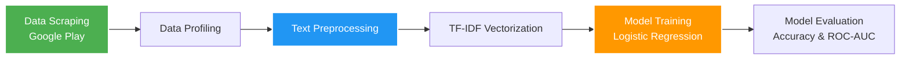
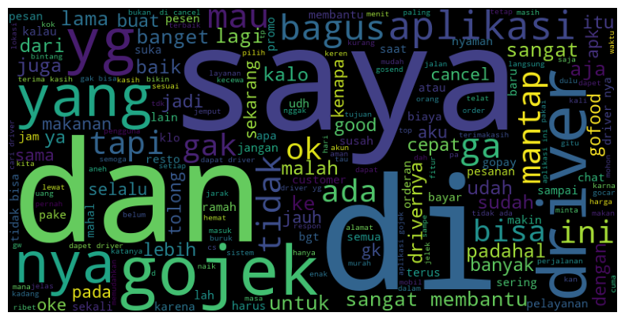
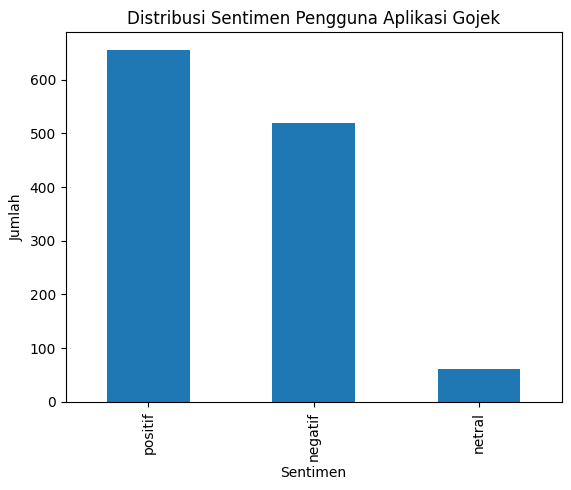
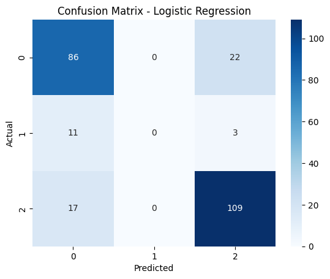

<div align="center">
  
# 🛵 Gojek Review Sentiment Analysis
**End-to-End Natural Language Processing (NLP) Pipeline with Logistic Regression**

[](https://www.python.org/)
[](https://scikit-learn.org/)
[](https://pandas.pydata.org/)
[](#)
[](#)

</div>

<br>

Sebuah proyek *Data Science* yang komprehensif, mulai dari ekstraksi data ulasan aplikasi Gojek di Google Play Store, pembersihan data (*text preprocessing*), hingga pemodelan *Machine Learning* untuk mengklasifikasikan opini publik menjadi sentimen **Positif**, **Netral**, dan **Negatif**. Proyek ini dibuat sebagai portofolio praktis implementasi NLP untuk Bahasa Indonesia.

---

## 📑 Daftar Isi
- [Alur Kerja Proyek (Pipeline)](#-alur-kerja-proyek-pipeline)
- [Fitur Utama](#-fitur-utama)
- [Hasil dan Performa Model](#-hasil-dan-performa-model)
- [Struktur Direktori](#-struktur-direktori)
- [Cara Instalasi & Menjalankan](#-cara-instalasi--menjalankan)

---

## ⚙️ Alur Kerja Proyek (Pipeline)



*(Catatan: Tahap preprocessing mencakup Case Folding, Regex Cleaning, Slang Normalization, NLTK Tokenization, Stopword Removal, dan Sastrawi Stemming).*

---

## ✨ Fitur Utama
1. **Automated Scraping**: Mengekstrak 2.000 ulasan pengguna paling baru secara otomatis menggunakan `google-play-scraper`.
2. **Advanced NLP Preprocessing**:
   - Pembersihan *noise* (URL, hashtag, mention, angka, emoji).
   - Pemetaan *dictionary* bahasa gaul/slang Indonesia yang dikustomisasi.
   - Menggunakan algoritma *Stemming* spesifik Bahasa Indonesia dari perpustakaan Sastrawi.
3. **Exploratory Data Analysis (EDA)**: Visualisasi *WordCloud* pada frasa dan kata-kata yang paling dominan muncul serta metrik distribusi statistik.
4. **Klasifikasi Teks Andal**: Menggunakan representasi matriks teks **TF-IDF (5000 *max features*)** yang dilatih menggunakan model prediktif **Logistic Regression**.
5. **Feature Extraction Interpretation**: Kemampuan model untuk membedah *Top 10 Features* (*koefisien model*) untuk melacak kata apa yang paling memicu suatu ulasan dianggap Positif, Netral, atau Negatif.

---

## 📊 Visualisasi & Hasil Performa Model

### Exploratory Data Analysis (EDA)
<div align="center">
  
  <br>
  <i>Visualisasi WordCloud: Kosakata yang paling dominan digunakan pengguna</i>
</div>

### Evaluasi Klasifikasi (Logistic Regression)
Model regresi logistik yang dilatih dievaluasi secara komprehensif untuk menguji keampuhan prediksinya. Evaluasi metrik yang disediakan mencakup:

- **Accuracy Score**: Proporsi prediksi sentimen yang berhasil ditebak dengan benar.
- **Classification Report**: Laporan terperinci mengenai metrik *Precision, Recall,* dan *F1-Score* untuk mengevaluasi bias/kepekaan model pada setiap kelas label.
- **Confusion Matrix**: Visualisasi menggunakan *Heatmap* untuk menganalisa peta penyebaran kesalahan dan keberhasilan klasifikasi matriks model.
- **ROC-AUC Score**: Menggunakan parameter komparasi multilabel *One-vs-Rest (OVR)* berbobot rata-rata untuk pengukuran probabilistik statistik.

<div align="center">
  
  
</div>

---

## 📂 Struktur Direktori

```text
📦 Project-DIP
 ┣ 📂 data/
 ┃ ┣ 📂 raw/                 # Data ulasan mentah hasil scraping CSV
 ┃ ┗ 📂 processed/           # Data teks bersih hasil tahap preprocessing
 ┣ 📜 Tubes_DIP_LogisticRegression.ipynb # Notebook utama Pipeline NLP
 ┣ 📜 requirements.txt         # Daftar pustaka (dependencies) Python 
 ┣ 📜 fix_notebook.py          # Skrip perbaikan kompatibilitas lokal Jupyter
 ┗ 📜 README.md                # Dokumentasi utama proyek
```

---

## 🚀 Cara Instalasi & Menjalankan

Langkah-langkah untuk menjalankan ulang dan menguji coba kode secara mandiri di komputer Anda:

1. **Clone repository ini**
   ```bash
   git clone https://github.com/rifqidzaki/Project-DIP.git
   cd Project-DIP
   ```

2. **Buat & Aktifkan Virtual Environment (Sangat Direkomendasikan)**
   ```bash
   python -m venv venv
   # Untuk pengguna Windows
   venv\Scripts\activate     
   # Untuk pengguna Linux/Mac
   source venv/bin/activate  
   ```

3. **Install Dependensi Library**
   ```bash
   pip install -r requirements.txt
   ```

4. **Jalankan Jupyter Notebook**
   ```bash
   jupyter notebook Tubes_DIP_LogisticRegression.ipynb
   ```

---

> **Penafian / Disclaimer**: Proyek ini dibuat sebagai pemenuhan Tugas Besar pada mata kuliah Data, Informasi, dan Pengetahuan (DIP). Silakan *fork* repositori ini jika ingin mengembangkannya lebih lanjut (misalnya melakukan *Hyperparameter tuning*, mengkomparasikan dengan model *Random Forest / LSTM*, atau *deploy* mengintegrasikannya ke dalam *dashboard Web Streamlit*).
